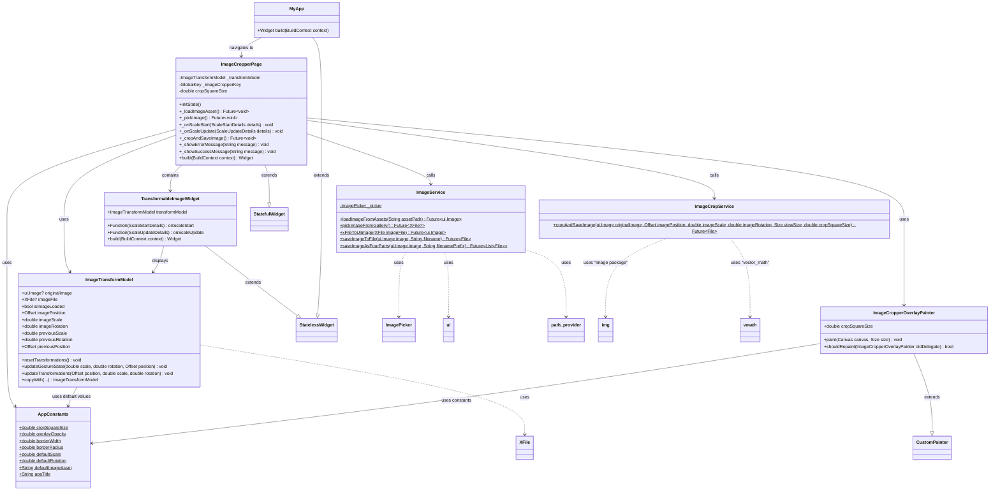

# 📊 Flutter Image Cropper - Klassendiagramm

## 🏗️ **Architektur-Übersicht**

### **📱 Presentation Layer (UI)**
- **MyApp**: Root-Widget der Anwendung
- **ImageCropperPage**: Hauptseite mit der Cropping-Funktionalität
- **TransformableImageWidget**: Widget für interaktive Bildtransformationen
- **ImageCropperOverlayPainter**: Custom Painter für das Crop-Overlay

### **🧠 Business Logic Layer**
- **ImageService**: Behandelt alle Image-Loading und -Saving Operationen
- **ImageCropService**: Spezialisiert auf komplexe Crop-Operationen

### **📊 Data Layer**
- **ImageTransformModel**: Verwaltet den State der Bildtransformationen

### **🔧 Utilities**
- **AppConstants**: Zentrale Konstanten-Verwaltung

## 🔗 **Abhängigkeiten & Beziehungen**

### **Composition Relationships (uses/contains)**
- `ImageCropperPage` **verwendet** `ImageTransformModel` für State-Management
- `ImageCropperPage` **enthält** `TransformableImageWidget` als Child-Widget
- `TransformableImageWidget` **zeigt** Daten aus `ImageTransformModel` an

### **Service Dependencies (calls)**
- `ImageCropperPage` **ruft auf** `ImageService` für Image-Operations
- `ImageCropperPage` **ruft auf** `ImageCropService` für Crop-Operations

### **Configuration Dependencies**
- Mehrere Klassen **verwenden** `AppConstants` für Konfigurationswerte

### **External Package Dependencies**
- `ImageService` nutzt `image_picker`, `path_provider`, `dart:ui`
- `ImageCropService` nutzt `image` package, `vector_math`
- `ImageTransformModel` nutzt `image_picker` für `XFile`

## 📈 **Vorteile dieser Struktur**

1. **Trennung der Verantwortlichkeiten**: Jede Klasse hat eine klare Aufgabe
2. **Lose Kopplung**: Services sind unabhängig von UI-Komponenten
3. **Hohe Kohäsion**: Verwandte Funktionalitäten sind zusammengefasst
4. **Testbarkeit**: Services können isoliert getestet werden
5. **Wiederverwendbarkeit**: Widgets und Services können in anderen Projekten verwendet werden
6. **Skalierbarkeit**: Neue Features können einfach hinzugefügt werden
